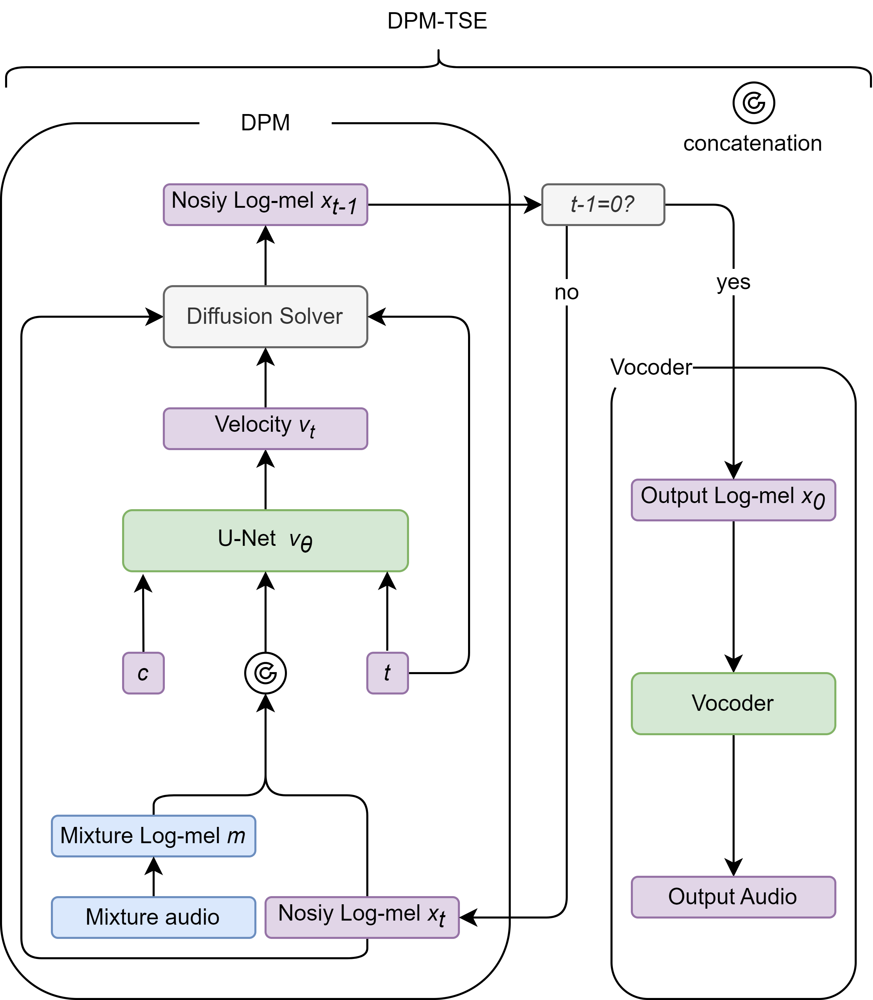
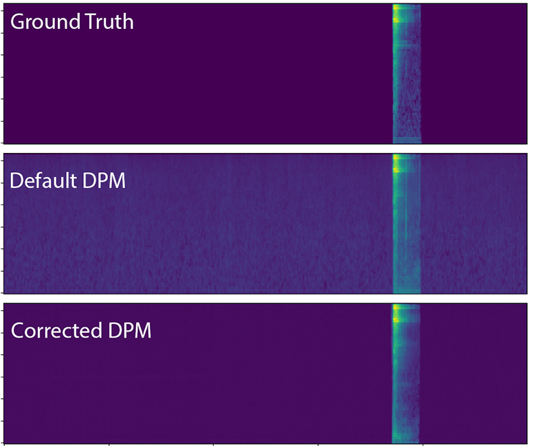
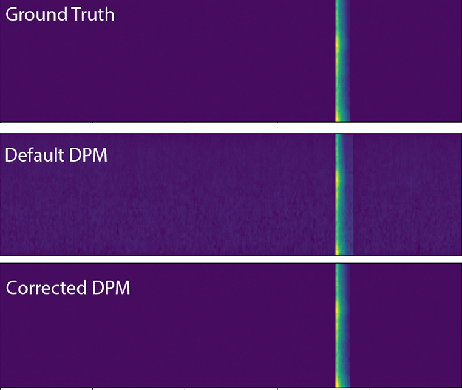

# A DIFFUSION PROBABILISTIC MODEL FOR TARGET SOUND EXTRACTION

Jiarui Hai🚀, Helin Wang🚀, Dongchao Yang, Karan Thakkar, Najim Dehak, Mounya Elhilali

😊[Repository](https://github.com/haidog-yaqub/DPMTSE/tree/main)

📄[PDF](https://github.com/haidog-yaqub/DPMTSE/tree/main)

### Abstract

Common target sound extraction (TSE) approaches primarily relied on discriminative approaches in order to separate the target sound while minimizing interference from the unwanted sources, with varying success in separating the target from the background. This study introduces DPM-TSE, a first generative method based on diffusion probabilistic modeling (DPM) for target sound extraction, to achieve both cleaner target renderings as well as improved separability from unwanted sounds. The technique also tackles common background noise issues with DPM by introducing a correction method for noise schedules and sample steps. This approach is evaluated using both objective and subjective quality metrics on the FSD Kaggle 2018 dataset. The results show that DPM-TSE has a significant improvement in perceived quality in terms of target extraction and purity.

## Model Framework

  

## Examples

<table>
  <tr>
    <th style="text-align: center; vertical-align: middle;">Mixture</th>
    <th style="text-align: center; vertical-align: middle;">Target Sound (GT)</th>
    <th style="text-align: center; vertical-align: middle;">Target Sound Label</th>
    <th style="text-align: center; vertical-align: middle;">DPM-TSE (Ours)</th>
    <th style="text-align: center; vertical-align: middle;">TSENET</th>
    <th style="text-align: center; vertical-align: middle;">WaveFormer</th>
  </tr>
  <tr>
    <td><audio controls><source src="./media/mixture/Applause_test_1082.wav" type="audio/wav"></audio></td>
    <td><audio controls><source src="./media/gt/Applause_test_1082.wav" type="audio/wav"></audio></td>
    <td style="text-align: center; vertical-align: middle;">Applause</td>
    <td><audio controls><source src="./media/dpm/Applause_test_1082.wav" type="audio/wav"></audio></td>
    <td><audio controls><source src="./media/tsenet/Applause_test_1082.wav" type="audio/wav"></audio></td>
    <td><audio controls><source src="./media/waveformer/Applause_test_1082.wav" type="audio/wav"></audio></td>
  </tr>
  <tr>
    <td><audio controls><source src="./media/mixture/Bark_test_625.wav" type="audio/wav"></audio></td>
    <td><audio controls><source src="./media/gt/Bark_test_625.wav" type="audio/wav"></audio></td>
      <td style="text-align: center; vertical-align: middle;">Bark</td>
    <td><audio controls><source src="./media/dpm/Bark_test_625.wav" type="audio/wav"></audio></td>
    <td><audio controls><source src="./media/tsenet/Bark_test_625.wav" type="audio/wav"></audio></td>
    <td><audio controls><source src="./media/waveformer/Bark_test_625.wav" type="audio/wav"></audio></td>
  </tr>
  <tr>
    <td><audio controls><source src="./media/mixture/Harmonica_test_1423.wav" type="audio/wav"></audio></td>
    <td><audio controls><source src="./media/gt/Harmonica_test_1423.wav" type="audio/wav"></audio></td>
     <td style="text-align: center; vertical-align: middle;">Harmonica</td>
    <td><audio controls><source src="./media/dpm/Harmonica_test_1423.wav" type="audio/wav"></audio></td>
    <td><audio controls><source src="./media/tsenet/Harmonica_test_1423.wav" type="audio/wav"></audio></td>
    <td><audio controls><source src="./media/waveformer/Harmonica_test_1423.wav" type="audio/wav"></audio></td>
  </tr>
  <tr>
    <td><audio controls><source src="./media/mixture/Meow_test_4.wav" type="audio/wav"></audio></td>
    <td><audio controls><source src="./media/gt/Meow_test_4.wav" type="audio/wav"></audio></td>
    <td style="text-align: center; vertical-align: middle;">Cat_Meow</td>
    <td><audio controls><source src="./media/dpm/Meow_test_4.wav" type="audio/wav"></audio></td>
    <td><audio controls><source src="./media/tsenet/Meow_test_4.wav" type="audio/wav"></audio></td>
    <td><audio controls><source src="./media/waveformer/Meow_test_4.wav" type="audio/wav"></audio></td>
  </tr>
  <tr>
    <td><audio controls><source src="./media/mixture/Shatter_test_924.wav" type="audio/wav"></audio></td>
    <td><audio controls><source src="./media/gt/Shatter_test_924.wav" type="audio/wav"></audio></td>
    <td style="text-align: center; vertical-align: middle;">Shatter</td>
    <td><audio controls><source src="./media/dpm/Shatter_test_924.wav" type="audio/wav"></audio></td>
    <td><audio controls><source src="./media/tsenet/Shatter_test_924.wav" type="audio/wav"></audio></td>
    <td><audio controls><source src="./media/waveformer/Shatter_test_924.wav" type="audio/wav"></audio></td>
  </tr>
  <tr>
    <td><audio controls><source src="./media/mixture/Snare_drum_test_844.wav" type="audio/wav"></audio></td>
    <td><audio controls><source src="./media/gt/Snare_drum_test_844.wav" type="audio/wav"></audio></td>
    <td style="text-align: center; vertical-align: middle;">Snare_Drum</td>
    <td><audio controls><source src="./media/dpm/Snare_drum_test_844.wav" type="audio/wav"></audio></td>
    <td><audio controls><source src="./media/tsenet/Snare_drum_test_844.wav" type="audio/wav"></audio></td>
    <td><audio controls><source src="./media/waveformer/Snare_drum_test_844.wav" type="audio/wav"></audio></td>
  </tr>
  <tr>
    <td><audio controls><source src="./media/mixture/Squeak_test_797.wav" type="audio/wav"></audio></td>
    <td><audio controls><source src="./media/gt/Squeak_test_797.wav" type="audio/wav"></audio></td>
     <td style="text-align: center; vertical-align: middle;">Squeak</td>
    <td><audio controls><source src="./media/dpm/Squeak_test_797.wav" type="audio/wav"></audio></td>
    <td><audio controls><source src="./media/tsenet/Squeak_test_797.wav" type="audio/wav"></audio></td>
    <td><audio controls><source src="./media/waveformer/Squeak_test_797.wav" type="audio/wav"></audio></td>
  </tr>
  <tr>
    <td><audio controls><source src="./media/mixture/Writing_test_1374.wav" type="audio/wav"></audio></td>
    <td><audio controls><source src="./media/gt/Writing_test_1374.wav" type="audio/wav"></audio></td>
     <td style="text-align: center; vertical-align: middle;">Writing</td>
    <td><audio controls><source src="./media/dpm/Writing_test_1374.wav" type="audio/wav"></audio></td>
    <td><audio controls><source src="./media/tsenet/Writing_test_1374.wav" type="audio/wav"></audio></td>
    <td><audio controls><source src="./media/waveformer/Writing_test_1374.wav" type="audio/wav"></audio></td>
  </tr>
  <!-- Repeat the above rows for additional audio samples -->
</table>

## Ablation Study

  

<table>
  <tr>
    <th style="text-align: center; vertical-align: middle;">Mixture</th>
    <th style="text-align: center; vertical-align: middle;">Target Sound (GT)</th>
    <th style="text-align: center; vertical-align: middle;">Target Sound Label</th>
    <th style="text-align: center; vertical-align: middle;">Default DPM</th>
    <th style="text-align: center; vertical-align: middle;">Corrected DPM</th>
  </tr>
  <tr>
    <td><audio controls><source src="./media/ablation/gt/mixture_test_1561.wav" type="audio/wav"></audio></td>
    <td><audio controls><source src="./media/ablation/gt/test_1561.wav" type="audio/wav"></audio></td>
    <td style="text-align: center; vertical-align: middle;">Tambourine (Instrument)</td>
    <td><audio controls><source src="./media/ablation/n_dpm/pred_test_1561.wav" type="audio/wav"></audio></td>
    <td><audio controls><source src="./media/ablation/v_dpm/pred_test_1561.wav" type="audio/wav"></audio></td>
  </tr>
</table>

  

<table>
  <tr>
    <th style="text-align: center; vertical-align: middle;">Mixture</th>
    <th style="text-align: center; vertical-align: middle;">Target Sound (GT)</th>
    <th style="text-align: center; vertical-align: middle;">Target Sound Label</th>
    <th style="text-align: center; vertical-align: middle;">Default DPM</th>
    <th style="text-align: center; vertical-align: middle;">Corrected DPM</th>
  </tr>
  <tr>
    <td><audio controls><source src="./media/ablation/gt/mixture_test_886.wav" type="audio/wav"></audio></td>
    <td><audio controls><source src="./media/ablation/gt/test_886.wav" type="audio/wav"></audio></td>
    <td style="text-align: center; vertical-align: middle;">Finger_Snapping</td>
    <td><audio controls><source src="./media/ablation/n_dpm/pred_test_886.wav" type="audio/wav"></audio></td>
    <td><audio controls><source src="./media/ablation/v_dpm/pred_test_886.wav" type="audio/wav"></audio></td>
  </tr>
</table>

